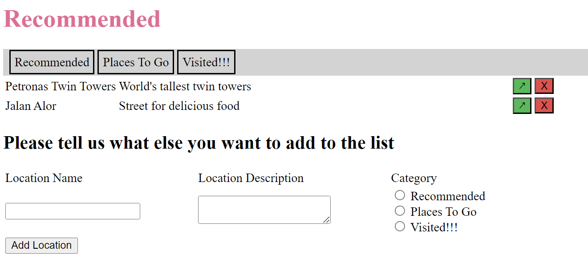

# Tourist Attractions

Welcome to **Tourist Attractions**, a Flask-based web application that helps you organize your list of places to visit into three categories:

- 🌟 **Recommended**: Places you want to visit.
- 🗺️ **Decided**: Places you've decided to visit.
- ✔️ **Visited**: Places you've already been to.

With Tourist Attractions, you can easily move locations between categories, remove them, and add new ones as needed.

## Table of Contents

- [Project Files](#project-files)
- [Getting Started](#getting-started)
- [How to Use](#how-to-use)
- [Contributing](#contributing)
- [Acknowledgements](#acknowledgements)
- [License](#license)

## Project Files

This project consists of several files:

### Static Files

- **styles.css**: Basic CSS files to give the application some style and improve the user interface.

### Templates

- **base.html**: Template header file that the main template file will inherit from. It provides the structure for the web pages.
- **locations.html**: This template file displays the tourist attraction data. It inherits from `base.html` and contains the layout for the application's pages.

### Data

- **data.csv**: Dummy data used to showcase the functionality of the application as we build it. You can replace this data with your own.

### Modules

- **locations.py**: This module contains the Locations class, which our application uses to add, modify, and delete location data. The Locations class provides three methods: `add()`, `moveup()`, and `delete()` for these operations.

### Flask Application

- **app.py**: The Flask application, which consists of three routes:
  - `locations()`: The main route that displays content associated with each category of location. It handles changing categories and location deletion.
  - `add_location()`: A form handling route that processes the add location form and redirects back to the `locations()` route.
  - `index()`: This route maps to the same path as `locations()` but without a category variable. It automatically redirects to the recommended page of the `locations()` route.

### Forms

- **forms.py**: A module that defines the form used in the application.

## Getting Started

Before you begin, feel free to explore each file to understand its role in the project. Familiarizing yourself with the project structure can help you follow along with the development process.

## How to Use

1. Run the Flask application using `flask run` or a similar command.
2. Visit the application in your web browser (usually at http://127.0.0.1:5000/).
3. Organize your list of places to visit into three categories: recommended, decided, and visited.
4. Move locations between categories, remove them, or add new ones as needed.

## Contributing

Contributions to this project are welcome! Feel free to open issues, submit pull requests, or provide feedback to improve the application.

## Acknowledgements

This project is part of the **"Build Python Web Apps with Flask Skill Path"** course offered by **Codecademy**. I created this application with guidance and inspiration from the **Codecademy** course materials. Special thanks to **Codecademy** for their valuable resources and instruction in web app development using Flask.

## License

This project is licensed under the [MIT License](LICENSE).
